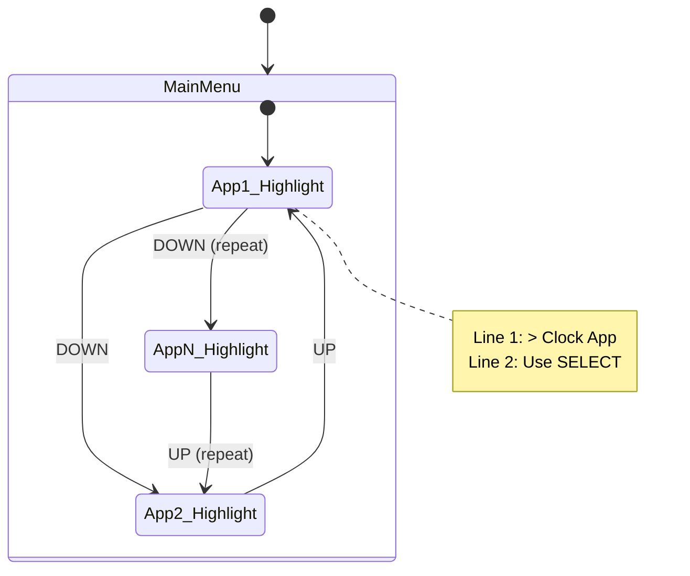
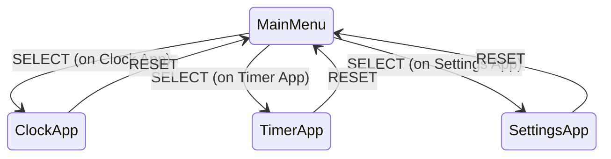
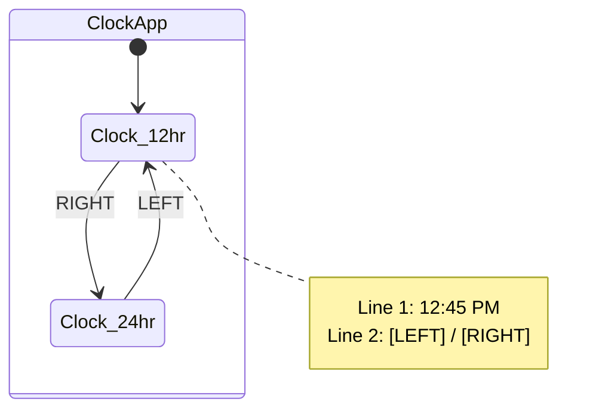
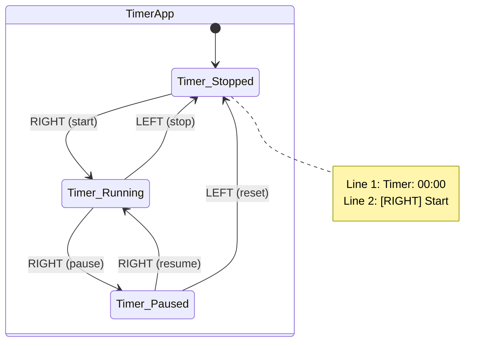
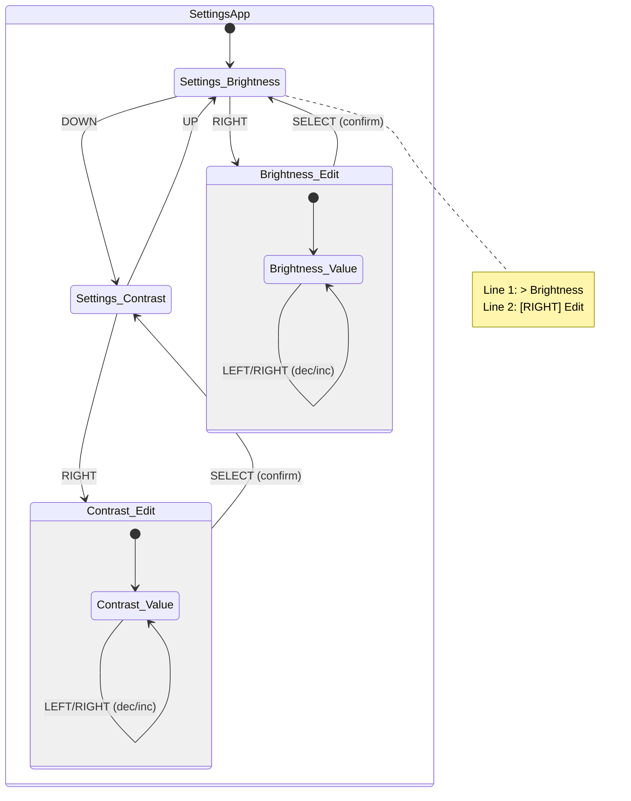

# Main menu

```mermaid
stateDiagram-v2
    [*] --> MainMenu

    state MainMenu {
        [*] --> App1_Highlight
        App1_Highlight --> App2_Highlight : DOWN
        App1_Highlight --> AppN_Highlight : DOWN (repeat)
        App2_Highlight --> App1_Highlight : UP
        AppN_Highlight --> App2_Highlight : UP (repeat)
        note right of App1_Highlight
            Line 1: > Clock App
            Line 2: Use SELECT
        end note
    }

```

```mermaid
stateDiagram-v2
    MainMenu --> ClockApp   : SELECT (on Clock App)
    MainMenu --> TimerApp   : SELECT (on Timer App)
    MainMenu --> SettingsApp : SELECT (on Settings App)
    
    ClockApp    --> MainMenu : RESET
    TimerApp    --> MainMenu : RESET
    SettingsApp --> MainMenu : RESET
```

# Clock

```mermaid
stateDiagram-v2

    state ClockApp {
        [*] --> Clock_12hr
        Clock_12hr --> Clock_24hr : RIGHT
        Clock_24hr --> Clock_12hr : LEFT
        note right of Clock_12hr
            Line 1: 12:45 PM
            Line 2: [LEFT] / [RIGHT]
        end note
    }
```
# Timer

```mermaid
stateDiagram-v2
    state TimerApp {
        [*] --> Timer_Stopped
        Timer_Stopped --> Timer_Running : RIGHT (start)
        Timer_Running --> Timer_Stopped : LEFT (stop)
        Timer_Running --> Timer_Paused  : RIGHT (pause)
        Timer_Paused  --> Timer_Running : RIGHT (resume)
        Timer_Paused  --> Timer_Stopped : LEFT (reset)
        note right of Timer_Stopped
            Line 1: Timer: 00:00
            Line 2: [RIGHT] Start
        end note
    }
```
# Settings

```mermaid
stateDiagram-v2
    state SettingsApp {
        [*] --> Settings_Brightness
        Settings_Brightness --> Settings_Contrast : DOWN
        Settings_Contrast --> Settings_Brightness : UP
        Settings_Brightness --> Brightness_Edit : RIGHT
        Settings_Contrast  --> Contrast_Edit   : RIGHT

        state Brightness_Edit {
            [*] --> Brightness_Value
            Brightness_Value --> Brightness_Value : LEFT/RIGHT (dec/inc)
        }
        state Contrast_Edit {
            [*] --> Contrast_Value
            Contrast_Value --> Contrast_Value : LEFT/RIGHT (dec/inc)
        }

        Brightness_Edit --> Settings_Brightness : SELECT (confirm)
        Contrast_Edit   --> Settings_Contrast   : SELECT (confirm)

        note right of Settings_Brightness
            Line 1: > Brightness
            Line 2: [RIGHT] Edit
        end note
    }


```
